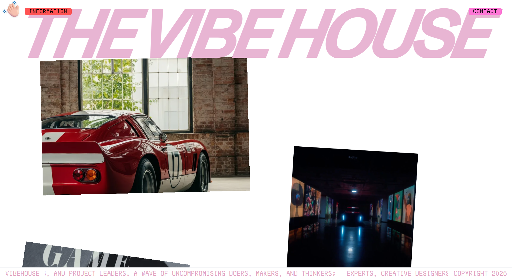
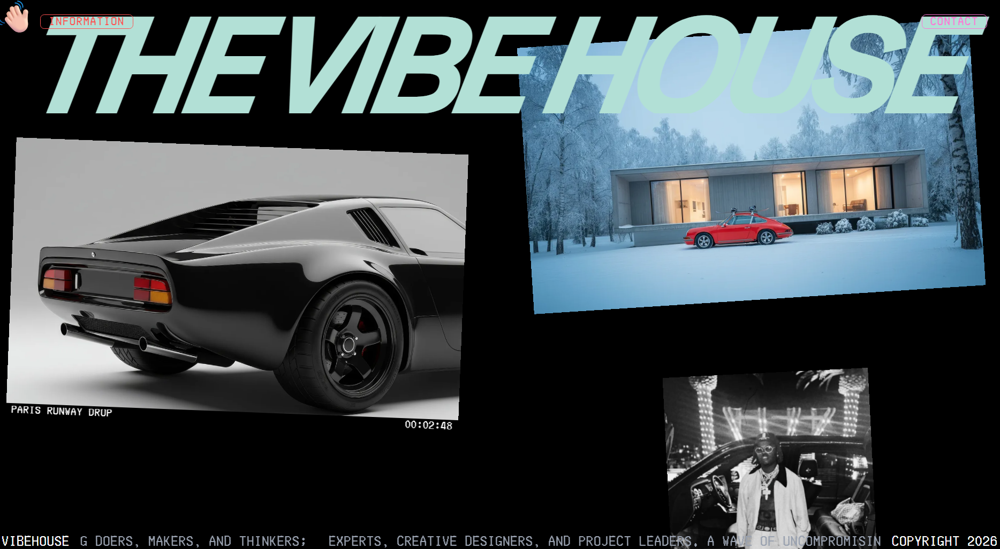
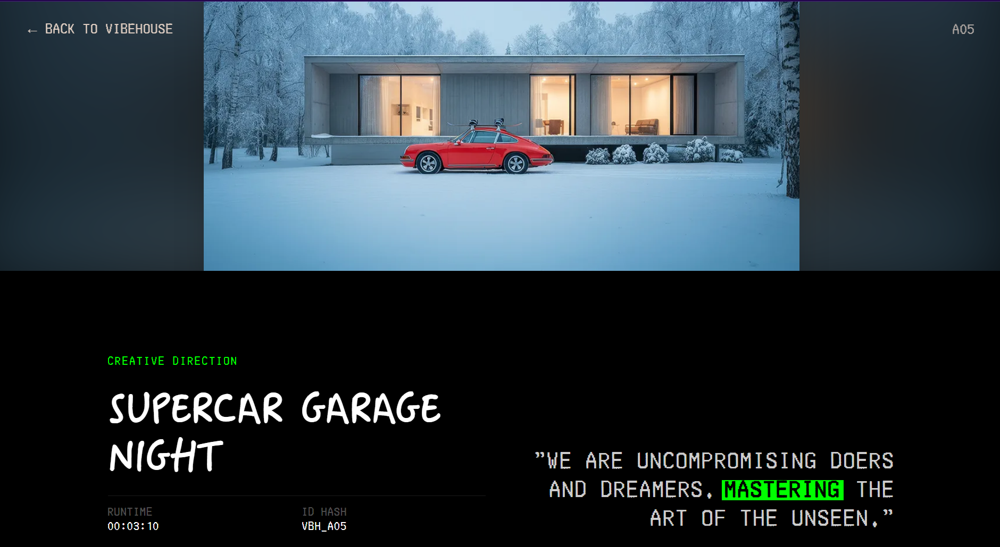
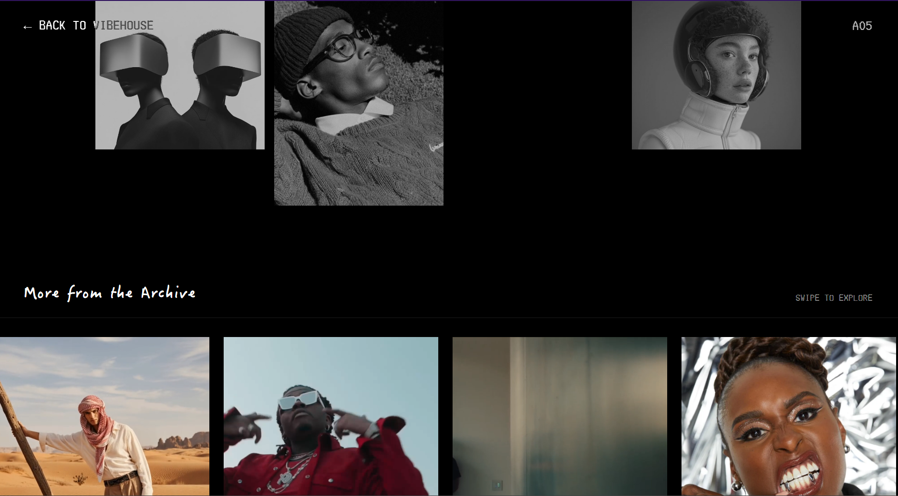
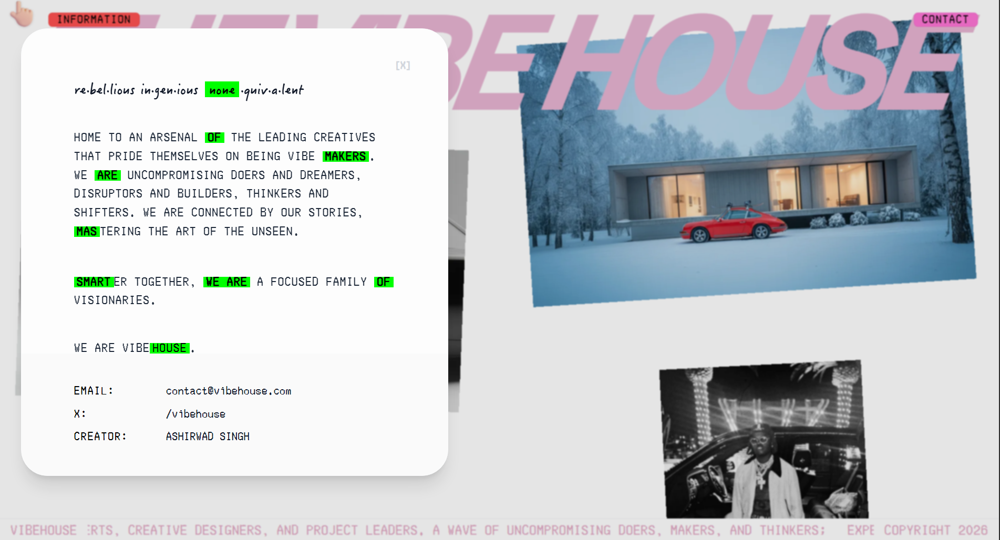

# VibeHouse — Creative Collage Gallery Template











## Overview

VibeHouse is a visual-first gallery template for showcasing creative projects with smooth scrolling and dynamic asset pages. ✨

## Tech Stack

Next.js (App Router) • React • Tailwind CSS • Framer Motion • GSAP • Lenis

⚠️ **IMPORTANT NOTICE:** This project is completely free and open-source. Please ensure you provide proper credit to the original creators and developers when using or sharing this codebase.

## Getting Started

1. Clone the repository
```bash
git clone https://github.com/Ethan4582/vibehouse
```

2. Install dependencies
```bash
pnpm install
# or npm install
```

3. Run the development server
```bash
pnpm dev
# or npm run dev
```

4. Open [http://localhost:3000](http://localhost:3000) in your browser.

## Credits

This project is a bespoke Next.js implementation developed to provide a high-performance, open-source gallery experience. It is inspired by modern digital studio portfolios and experimental arcade aesthetics.

## Developer

**Developed by:** [@Ethan4582](https://github.com/Ethan4582)  
**Contact:** [@SinghAshir65848](https://x.com/SinghAshir65848)

## ☕ Support the Creator

If you find this project useful, consider supporting the development!  
Your contribution helps in maintaining and sharing high-quality open-source projects.

 [Buy Me a Coffee](https://buymeacoffee.com/ashirwad05)

## License

This project is open-source. Please credit the original designer when using this work I dont remember the name of the designer.